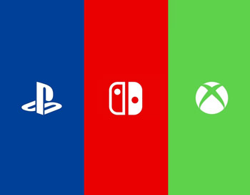
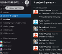
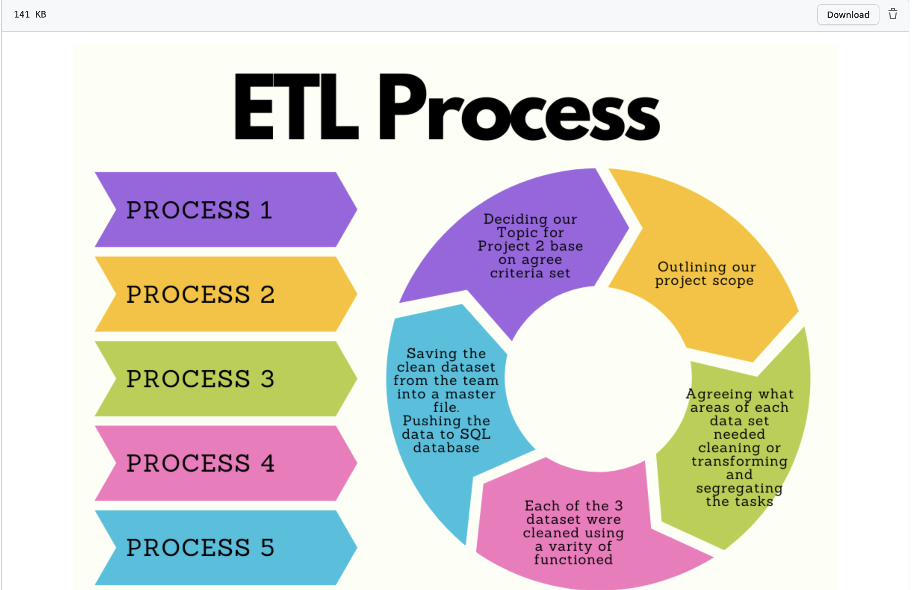
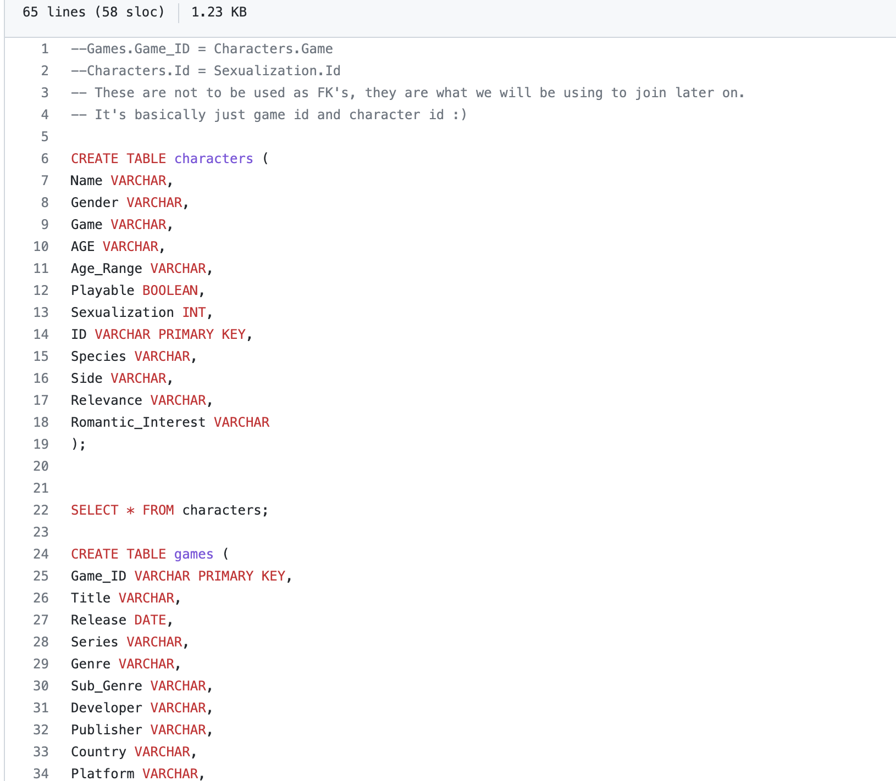
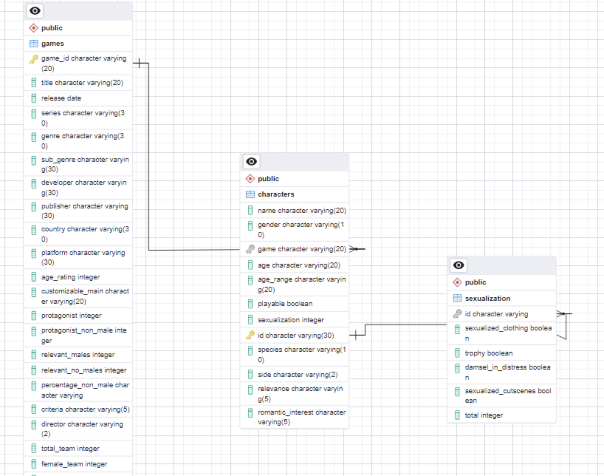

# Project-2

## Team Members: Charlotte, Farah, Helen, Kassem, Prerna

# Gender Representation in Video Games

### The aim of our project is to use the ETL process to clean a dataset relating to our chosen topic 
### of uncovering gender patterns in video games across multiple platforms focusing on gender
### representation within modern day video games. 

# The Project
For the main project we created a list of the items we needed to complete and shared the workload between the group and set deadline for review so
we had a realistic timeline to complete the project as well as safeguard by having regular reviews.  

o    Project ideation  
o    Data fetching  
o    Data analysis  
o    Cleaning & Transforming  
o    Data loading into final database  
o    Creating documentation (Technical report and Project Visuals)

### Data Sources

We found and used three datasets that focused on gender representation within modern day video games, sourced from Kaggle.com & diamondlobby.com. These 
datasets were games data, character data & sexualisation info.

### Our Datasets

[Charecter data](Resources/characters.grivg.csv)  
[Game data](Resources/games.grivg.csv)  
[Sexulisation data](Resources/sexualization.grivg.csv)  

# Group Communication

To be able to complete this project effectively, we ensure we had effective communication within our 
group. We put in place a various mediums, firstly we began by creating our own slack channel just with our 
group members.

Secondly, we also created a WhatsApp group again just with our group members init which we 
discuss the project during our working and personal hours.  
 
.  

Lastly, to enable us to work together and collaborate effectivly. 
We also booked in extra session where we work together and on our respective parts using Team as the platform.  

.

# ETL Process Map

### Our groups project process map of actions:

[Process Map](https://github.com/kass173/Project-2/blob/main/Process%20Map/Colorful%20Process%20Prjt%202.png)

# The schema

Attached is the schema used in our final database and our final databased will be of a relational database structure containing data organised into tables:

[Schema](https://github.com/kass173/Project-2/blob/main/Gen_Rep_%20Games.sql).

.  

### Entity Relationship Diagram.  

The Entity relationship diagram that show how our data between the datasets is interelated and the relationship or status of each data type and any connection strings.

.    

# Final Database

Find attached a link to our final SQL database and the Jupyter files for cleaning our dataset prior to the load.

The final database consisted of 3 tables (Game, Character & Sexulisation Data). We had to ensure the primary keys used for the tables were unique. 
Table 1, Games and Table 2, Characters were joined on 1 column (game.game_id = character.game) . 

Game_id, is the primary key in table Game. In the Character table game column game character is where the datasets join hence functions as a foreign key.  

Within the Characters Table we joined to the Sexualization table we linked on ID_charecter column which is also a primary key.  

[Jupyter Data Clean File] (https://github.com/kass173/Project-2/blob/main/Final_jupytercode.ipynb).  
[Final SQL Database](https://github.com/kass173/Project-2/blob/main/final_sequeldatabase.sql).

The reason this topic was chose was due to our common interested in video games and being a majority female group when we discussed this dataset we were interested in finding if games still harboured patriarchal influences.

The data that we looked at in 2022 seems to suggest we clearly don’t have equality between male and female representation in video games yet. But, the industry is undoubtedly making improvements albeit slowly in introducing a large number of female main charecters.

