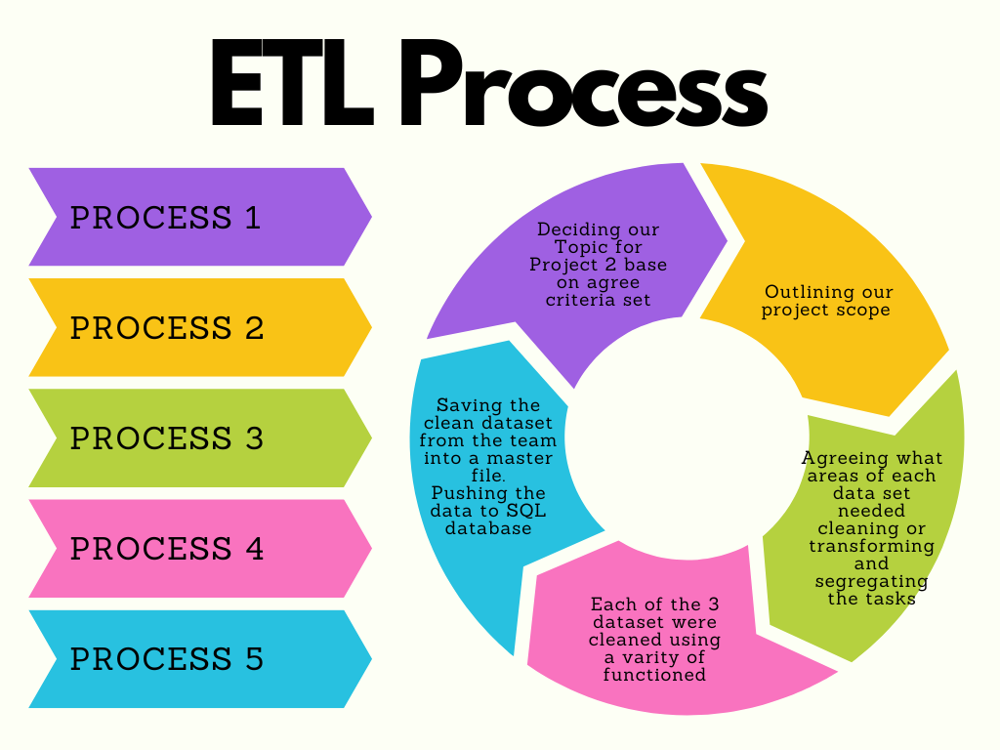

# Project-2

##Team Members: Charlotte, Farah, Helen, Kassem, Prerna

# Gender Representation in Video Games

The aim of our project is to uncover patterns in games across multiple platforms
relating to gender representation within modern day games. 

#Process Map

Group Project 2 Process map of actions

