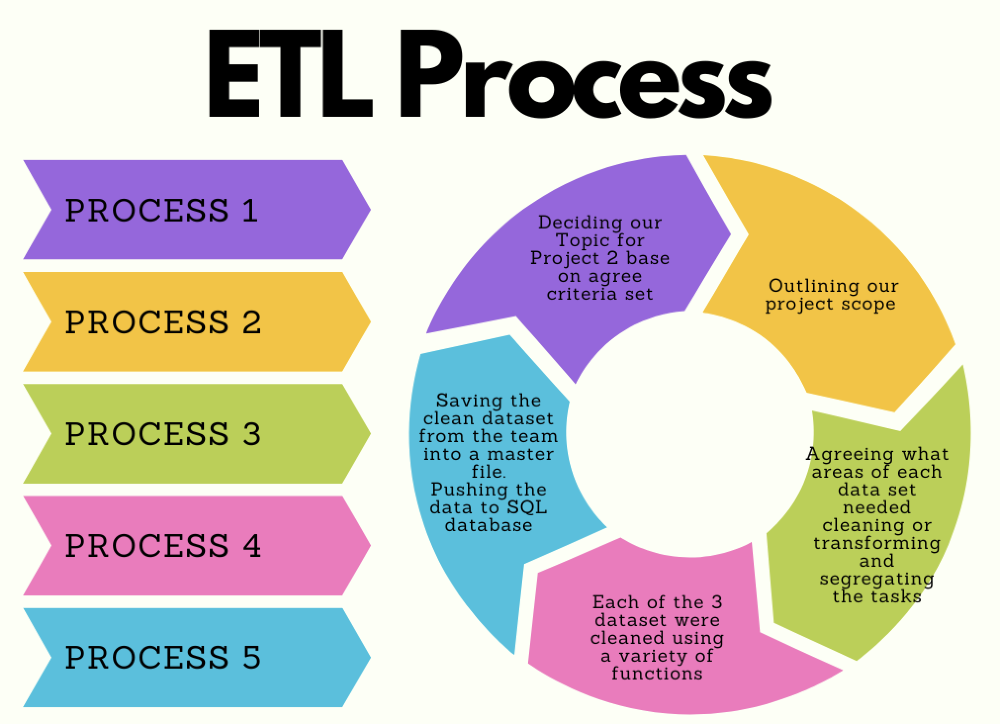

# Project-2

Team Members: Charlotte, Farah, Helen, Kassem, Prerna

# Gender Representation in Video Games

The aim of our project is to uncover patterns in games across multiple platforms
relating to gender representation within modern day games. 

### Our Datasets

[Charecter data](Resources/characters.grivg.csv),
[Game data](Resources/games.grivg.csv),
[Sexulisation data](Resources/sexualization.grivg.csv),

# Process Map

Group Project 2 Process map of actions:

[Process Map](https://github.com/kass173/Project-2/blob/main/Process%20Map/Colorful%20Process%20Prjt%202.png)

# The schemata

Attached is the schemata used in our final database:

[Schemata](https://github.com/kass173/Project-2/blob/main/Gen_Rep_%20Games.sql).

