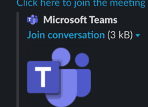

# Project-2

## Team Members: Charlotte, Farah, Helen, Kassem, Prerna

# Gender Representation in Video Games

The aim of our project is to use the ETL process to clean a dataset relating to our chosen topic 
of uncovering gender patterns in video games across multiple platforms focusing on gender
representation within modern day video games. 

### Data Sources

We found and used three datasets that focused on gender representation within modern day video games, sourced from Kaggle.com & diamondlobby.com. These datasets were games data, character data & sexualisation info.

### Our Datasets

[Charecter data](Resources/characters.grivg.csv)  
[Game data](Resources/games.grivg.csv)  
[Sexulisation data](Resources/sexualization.grivg.csv)  

# ETL Process Map

### Our groups project process map of actions:

[Process Map](https://github.com/kass173/Project-2/blob/main/Process%20Map/Colorful%20Process%20Prjt%202.png)

# The schema

Attached is the schema used in our final database and our final databased will be of a relational database structure containing data organised into tables:

[Schema](https://github.com/kass173/Project-2/blob/main/Gen_Rep_%20Games.sql).

.  

### Entity Relationship Diagram.  

The Entity relationship diagram that show how our data between the datasets is interelated and the relationship or status of each data type and any connection strings.

.  

# Group Communication

To be able to complete this project effectively, we ensure we had effective communication within our 
group. We put in place a various mediums, firstly we began by creating our own slack channel just with our 
group members.

Secondly, we also created a WhatsApp group again just with our group members init which we 
discuss the project during our working and personal hours.  
 
.  

Lastly, to enable us to work together and collaborate effectivly. 
We also booked in extra session where we work together and on our respective parts using Team as the platform.  

.  

# The Project
For the main project we created a list of the items we needed to complete and shared the workload between the group and set deadline for review so
we had a realistic timeline to complete the project as well as safeguard by having regular reviews.  

o    Project ideation  
o    Data fetching  
o    Data analysis  
o    Cleaning & Transforming  
o    Data loading into final database  
o    Creating documentation (Technical report and Project Visuals)

# Final Database

Find attached a link to our final clean load.  

[Final SQL Database](https://github.com/kass173/Project-2/blob/main/Gen_Rep_%20Games.sql).
